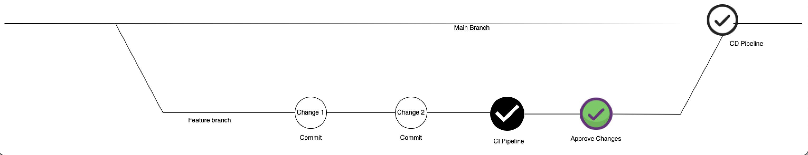

GitOps (short definition) :

Infrastructure as code done right with all the best practices.

---

IaC :
- Define infrastructure as code instead of creating it manually.
- Infrastructure can be easily reproduced

X as Code :
Network as Code
Security as Code
Configuration as Code
Policy as code

---
IAC the wrong way :
- Create IAC files and test in local
- Push in git repo
- Manually apply changes to infrastructure.

What is missing :
- No pull request (Merge requests)
- No code reviews
- No collaboration
- No automated tests
- Maybe we have introduce a breaking change, forgot to push updated file, invalid yaml or config files, typos

Problems in wrong way :
- Everyone has access to infrastructure
- Hard to trace 
- Need to test manually 

---

GitOps Flow

- Automated Process
- More transparent
- Quality IaC

Two ways of applying changes:

- Push deployment
Application is built and pipeline executes a command to deploy the application
Example tools :
    - Jenkins
    - Gitlab

- Pull deployment
Agent is installed in the environment eg. in K8s cluster which actively pulls the changes from git repo.
It monitors and compares desired state with actual state.
Example tools :
    - ArgoCD
    - FluxCD

 

GitOps Advantages :
- Rollback to any previous state just by git reverting.
- IaC files are stored centrally on a remote Git server.
- Environment always synced with desired state in Git repo.
- Single source of truth.
- Increase security because only CD needs the access rather than giving access to individual access.
- Anyone can propose changes, just by raising PR.
- Less permission to manage

**GitOps is IaC + Version Control + Pull/Merge requests + CI/CD pipeline**

