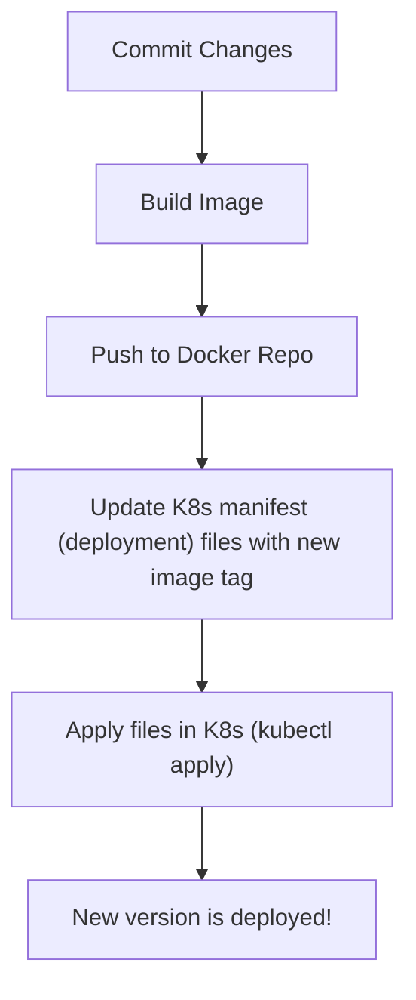
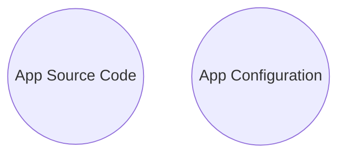
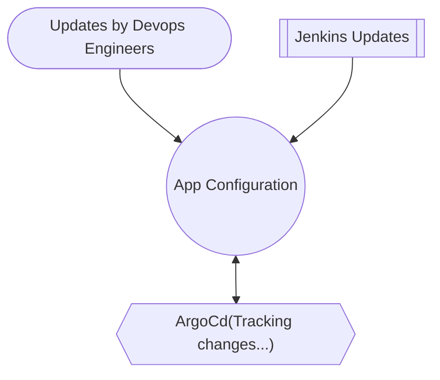
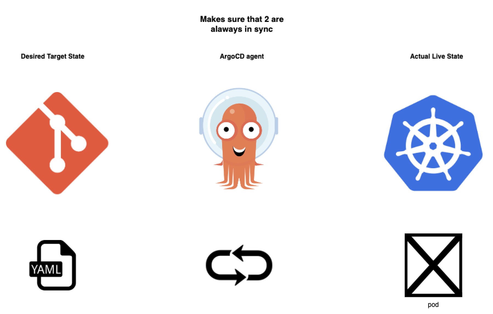

## ArgoCD
From official doc : _Argo CD is a declarative, GitOps continuous delivery tool for Kubernetes_

- CD for kubernetes
- Based on GitOps

---

CD workflow without Argo CD :

Build Image (CI) and deployed to K8s cluster (CD) using traditional approach:



Challenges with the approach : 
- Need to install setup tools, like kubectl to access k8s cluster on automation tools
- Need to configure access to k8s
- Configure access to cloud platforms
- Security challenges
- No visibility of deployment status like did app get created successfully in the cluster?

ArgoCD was built to make CD in k8s more efficient.

---

ArgoCD as better alternative
- Reverses the flow
    - ArgoCD is a part of K8s cluster
    - ArgoCD agent pulls K8s manifest changes and applies them
```mermaid
    flowchart LR;
    A["Git Repo (Consists of yaml files)"]
    <---->|pull| B["K8s (with running Argo agent)"]
 ```

CD workflow with ArgoCD :

```mermaid
    graph TD;
    A["Deploy ArgoCD in K8s cluster"]-->
    B["Configure ArgoCD to track git repo"]-->
    C["ArgoCD monitors for any changes and applies automatically"]
 ```


Build Image (CI) and deployed to K8s cluster (CD) using ArgoCD:

```mermaid
    graph TD;

    subgraph CD
    X2["'App Configuration'"] <-->|pull|E["ArgoCD"] -->F["New version is deployed!"]
    end

    subgraph CI

    A["Commit Changes"] -->
    B["Build Image"] -->
    C["Push to Docker Repo"] -->
    D1["Update K8s manifest
 (deployment) files with new image tag in 
 'App Configuration' repo"] --> 
    X1["'App Configuration'"] 
    end
```

Best Practices:
- Separate git repo for app source and app config (K8s manifest files).

- Separate git repo for system configs.

Need of separate Git repo?


- App config code will contain not only deployment file but also configmaps, secrets, ingress etc.
- K8s manifest file can change independent of source code
- You don't want to trigger the full CI pipeline when app source code has not changed.
- Don't want complex logic in CI pipeline.


ArgoCD supports :
- Kubernetes YAML files
- Helm charts 
- Kustomize
- Template files that generate K8s manifests

GitOps Repo :

Result of splitting CI and CD :
Separation of concerns is achieved
- CI part can be fully managed/owned by Developers / DevOps.
- CD part can be fully managed/owned by Operations / DevOps. 


---

Benefits of Argo CD
- Whole K8s configuration defined as Code in git repository (App configuration). No need to run helm or kubectl manually from machine.
- Git as single source of truth. If there is any manual updates, argo cd will detect the state (desired != actual) and overwrite the changes.
- Fully cluster transparency.
- It can be configured to not to sync manual cluster changes automatically
- Provides single interface, version controlled changes, audit trail, better team collaboration (PR), history of changes.
- Easy Rollback - We can rollback to any previous state, no need to manually revert every update in the cluster.
- Cluster disaster recovery - As we have describe our whole cluster in code (git repo) in declarative way, cluster disaster recovery is easy.
- Benefits we get GitOps in general

---

K8s access control with Git
- Not everyone should have access to K8s cluster
- Give way to manage cluster access indirectly via Git
- No need to create cluster roles and user roles in K8s
- No need to give external cluster access to non human users (like jenkins) because Argo CD is already running in the cluster
- No cluster credentials outside K8s

---

ArgoCD as K8s extension :
ArgoCD uses existing K8s functionalities like etcd to store data, using K8s controllers for monitoring and comparing actual and desired state

Benefits :
- Visibility of cluster - Real time updates of application state (like tracking status of pod created, healthy status)

---

ArgoCD overview :

