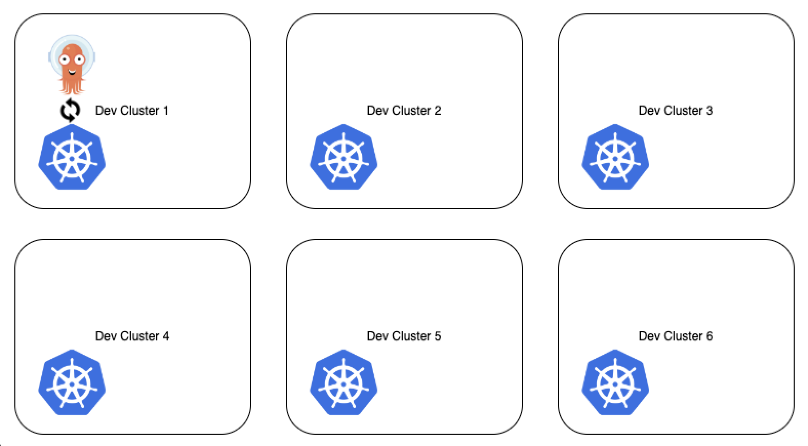
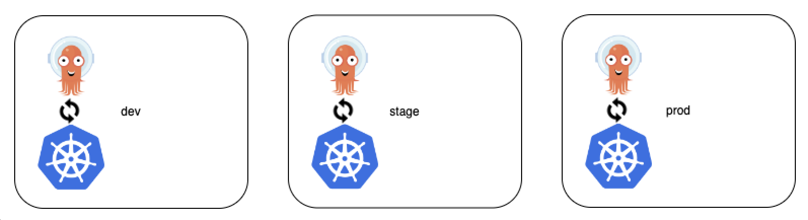
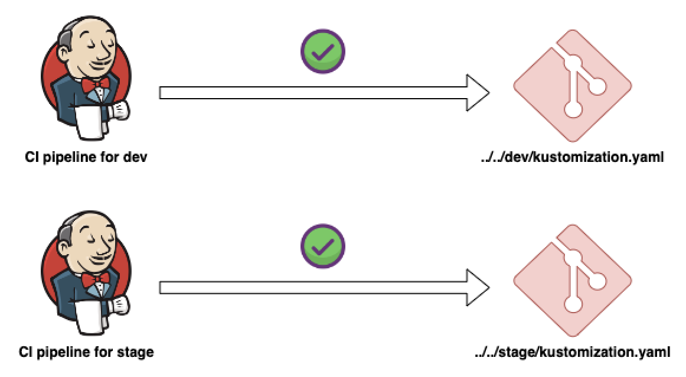

How to configure ArgoCD?
- Deploy ArgoCD into K8s cluster. Extends the K8s api with CRD.
- Configure ArgoCD with K8s YAML file.

```yaml
apiVersion: argoproj.io/v1alpha1
kind: Application
metadata:
  name: guestbook
  namespace: argocd
spec:
  project: default

  #======> Which git repo?
  source:
    repoURL: https://github.com/argoproj/argocd-example-apps.git
    path: guestbook
  #======> Which K8s cluster? 
  # Cluster can be on which argo cd is running or a external cluster
  destination:
    server: https://kubernetes.default.svc
    namespace: guestbook

  syncPolicy:
    syncOptions:
    - CreateNamespace=true
```
Multiple YAML files can be there for multiple application like `frontend-app.yaml`,`store-app,yaml`,`billing-app.yaml`,`notification-app.yaml`, etc. 

We can logically group these application and set restriction what (git repo) may be deployed, where (cluster & ns) apps maybe deployed to.

---

Working with multiple clusters :

Case 1 : When we have set of same cluster environment / cluster replicas (let say development) -
- We need to configure and manage just 1 ArgoCD (running on a cluster)
- Same ArgoCD instance is able to sync a feet of K8s clusters



Case 2 : When we have set of different cluster environment / multi cluster environment(dev, stage, prod) - 


We may need to run agent on each cluster
Challenges:
- We have 1 repo for application
- But we don't want to deploy app changes at once. We need to test it on dev, then copy changes to stage and followed by prod.

Method 1 (Less recommended but still commonly used ): 
- Git branch for each environment like dev, stage, prod.

Method 2 (Recommended) :
- Use overlays with kustomize. We can selectively changes specific part and deploy the changes. 

```bash
my-example-app/
├── base
│   ├── deployment.yaml
│   ├── kustomization.yaml
│   └── service.yaml
└── overlays    <======= use of overlays
    ├── dev
    │   ├── deployment.yaml
    │   ├── kustomization.yaml
    │   ├── namespace.yaml
    │   └── service.yaml
    ├── stage
    │   ├── deployment.yaml
    │   ├── kustomization.yaml
    │   ├── namespace.yaml
    │   └── service.yaml
    └── prod
        ├── deployment.yaml
        ├── kustomization.yaml
        ├── namespace.yaml
        └── service.yaml
```


---

Is ArgoCD replacement for other CI/CD tools?
- No we still need CI tools for operations like test, build images, push images and update manifest code changes.
- ArgoCD is replacement for CD specifically for K8s

ArgoCD Alternatives :
- Jenkins X
- FluxCD
