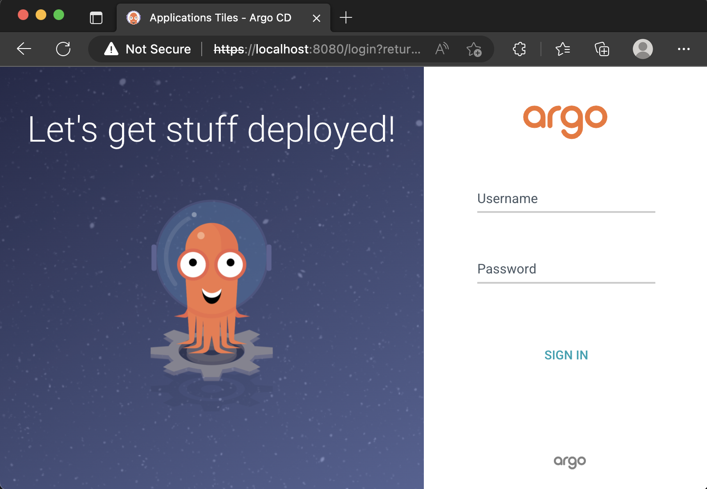
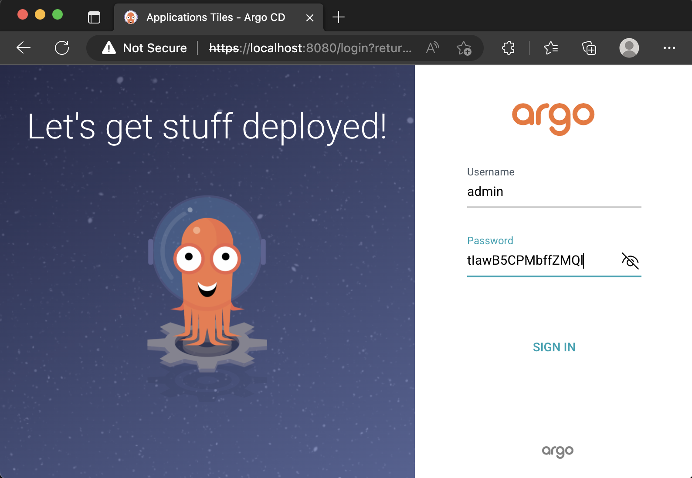
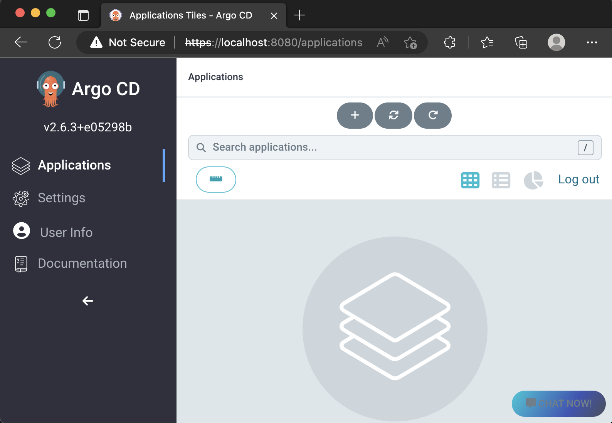

### Prerequisite 
- K8s cluster (We'll use minikube)
- `kubectl` cli
- k9s (optional)


### [Optional] Minikube setup (Skip if you have running a running K8s cluster)
Follow steps from [minkube-steup.md](./minkube-steup.md)

### Step
These steps can be found in [official doc](https://argo-cd.readthedocs.io/en/stable/getting_started/)

- Create argocd namespace 
```
kubectl create namespace argocd
```
- Install argo cd on cluster
```
kubectl apply -n argocd -f https://raw.githubusercontent.com/argoproj/argo-cd/stable/manifests/install.yaml
```
- Wait for all pods in argocd ns to be in running state
```
kubectl get po -n argocd 
NAME                                                READY   STATUS    RESTARTS   AGE
argocd-application-controller-0                     1/1     Running   0          2m23s
argocd-applicationset-controller-856fdb5b7d-pnxtt   1/1     Running   0          2m24s
argocd-dex-server-6fb9c4c758-6s944                  1/1     Running   0          2m23s
argocd-notifications-controller-559678b486-qxzlr    1/1     Running   0          2m23s
argocd-redis-598f75bc69-96v9b                       1/1     Running   0          2m23s
argocd-repo-server-6f59bcb67d-cqg64                 1/1     Running   0          2m23s
argocd-server-75b884dc7-dhhsd                       1/1     Running   0          2m23s
```
- Port forward for argocd ui
```
kubectl port-forward -n argocd svc/argocd-server 8080:443
```

- Open https://localhost:8080/ 


- Get username and password
Username will be `admin`
For password, decode `password`'s value in `argocd-initial-admin-secret` secret
```
kubectl get secrets -n argocd argocd-initial-admin-secret -o yaml
```
```
$ echo dElhd0I1Q1BNYmZmWk1RbA== | base64 --decode  
```
OR in single command
```
kubectl -n argocd get secret argocd-initial-admin-secret -o jsonpath="{.data.password}" | base64 --decode && echo
```
- Use credentials from above output



