Configure ArgoCD with "application" CRD

- To configure an app in ArgoCD, we'll need to create a app config repo.
- Add kubernetes resources like `deployment.yaml`, `service.yaml` resources.
- Create ArgoCD application (`application.yaml`).
- Content of `application.yaml` :
```
# Check  apiVersion is updated / changed
apiVersion: argoproj.io/v1alpha1
kind: Application
metadata:
  name: myapp-argo-application
  namespace: argocd
spec:
  # The project the application belongs to.
  # if unspecified, then it is default
  project: default

  # git repo to pull/sync application config
  source:
    repoURL: https://github.com/naveen-st/argocd-app-config.git # Can point to either a Helm chart repo or a git repo.
    # HEAD = always the last commit
    targetRevision: HEAD
    # sync or track the specific path in the repo. In our case we need to sync the 'dev' path
    path: dev

# Cluster where argo cd will apply the actions
  destination: 
    # address of k8s cluster. In our case ArgoCD is deployed in the same cluster.
    # https://kubernetes.default.svc is internal dns name for api server
    server: https://kubernetes.default.svc 
    # name to apply the configs
    namespace: myapp

  syncPolicy:
    syncOptions:
    - CreateNamespace=true # Namespace Auto-Creation ensures that namespace specified as the application destination exists in the destination cluster.
      
    automated: # automated sync by default retries failed attempts 5 times with following delays between attempts ( 5s, 10s, 20s, 40s, 80s ); retry controlled using `retry` field.
      selfHeal: true # Specifies if partial app sync should be executed when resources are changed only in target Kubernetes cluster and no git change detected ( false by default ).
      prune: true # Specifies if resources should be pruned during auto-syncing
```
- Detailed application sample yaml can be found [here](https://github.com/argoproj/argo-cd/blob/master/docs/operator-manual/application.yaml)

- ArgoCD polls Git repo every 3 minutes
- To get rid from this delay, we can configure a git hook.


- Apply `application.yaml`

```
kubectl apply -f application.yaml
```

- Application created and running 
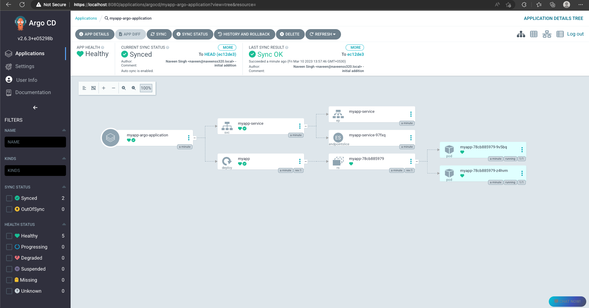
- Events
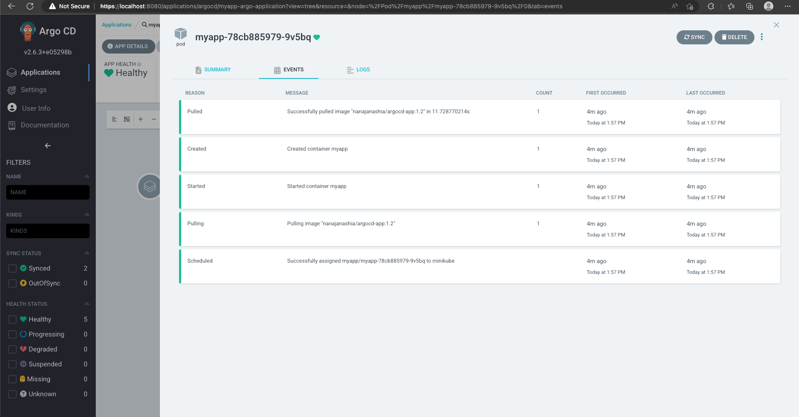
- Logs
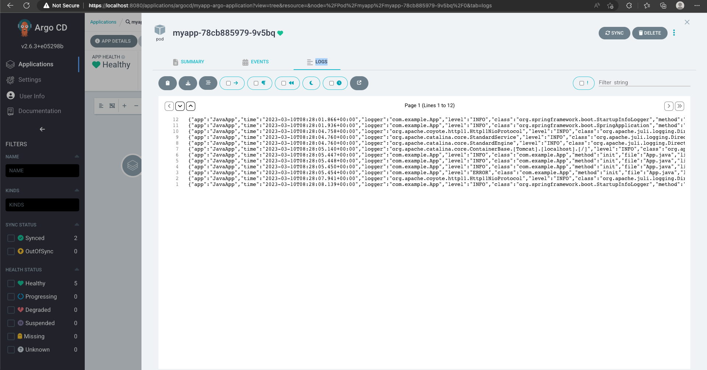
- Summary
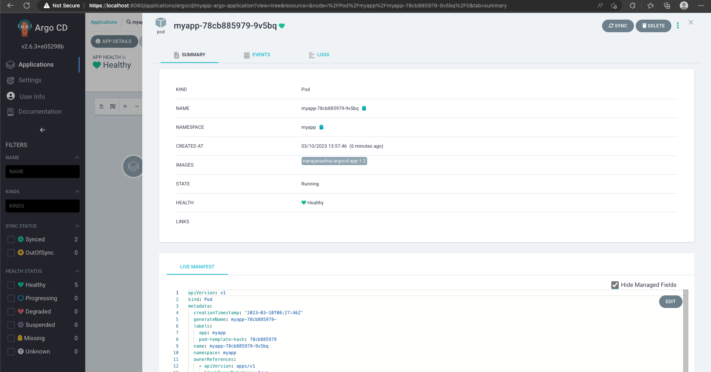
- Live manifest
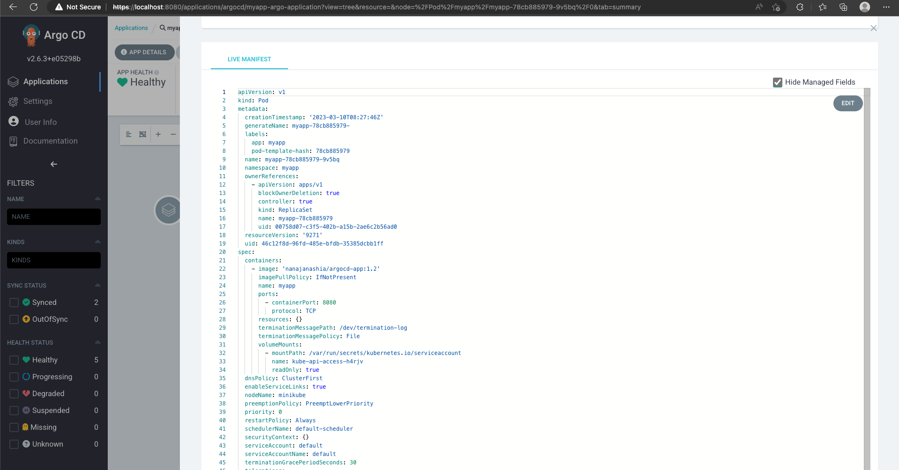

---

Testing automatic sync :

- Update any parameter to test changes. We'll change pod's image version to test changes.
- Commit and push the changes to configured app repo and wait for 3mins (default polling time) OR click refresh in the UI.
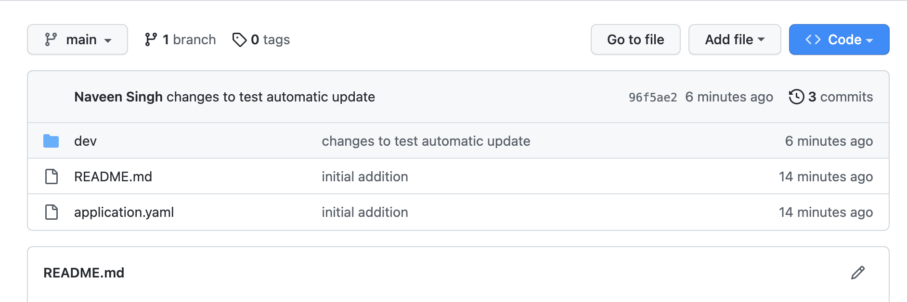
- After 3mins wait / OR clicking refresh from UI
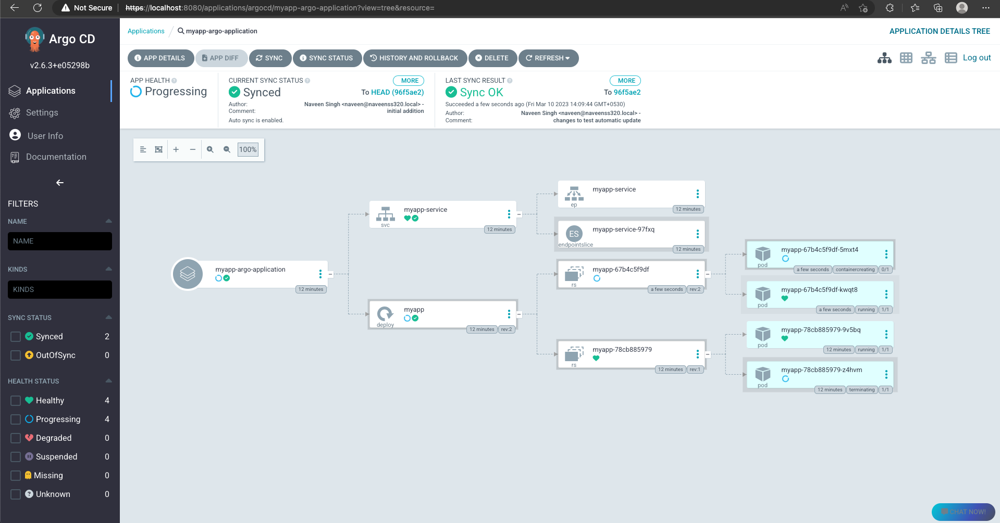
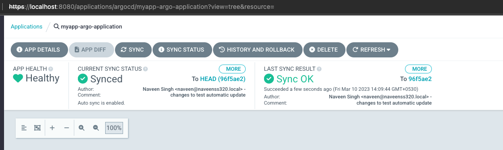

---

Testing automatic pruning :
- We'll change deployment's name to test changes.Once repo updated, it should delete the existing deployment.
- Syncing :
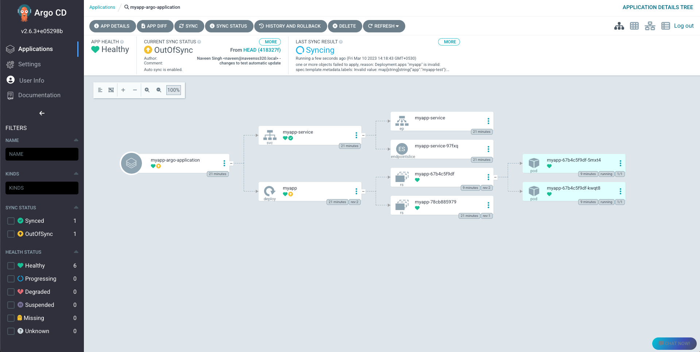
- Synced and deleted the old deployment (myapp)
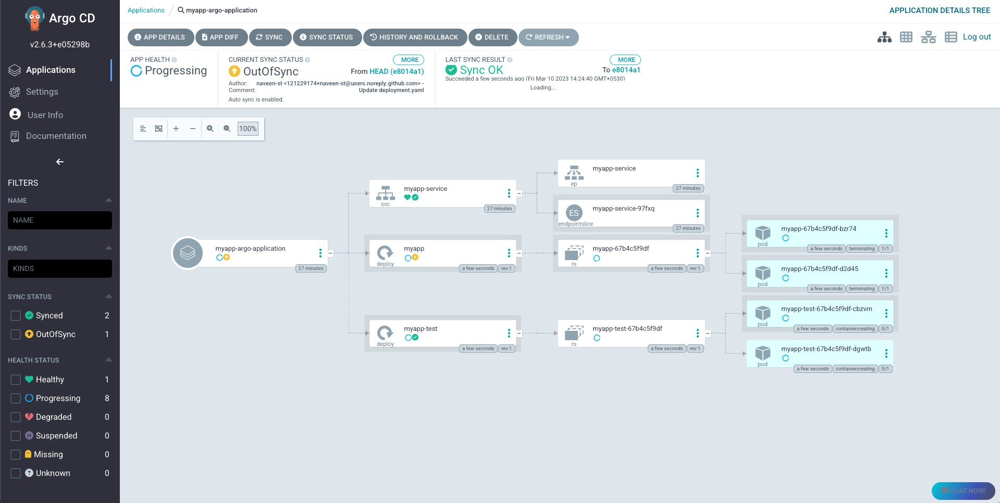

---

Test manual operation
- To test ArgoCD overrides manual operations, try updating any parameter. We'll update deployment replicas values (from 2 to 4).
- `kubectl scale deployment -n  myapp myapp-test --replicas 4`
- Updated replicas to 4, but ArgoCD reverted it back to 2.
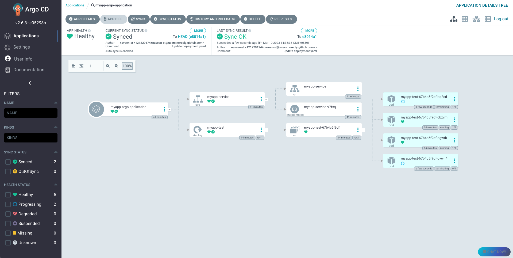
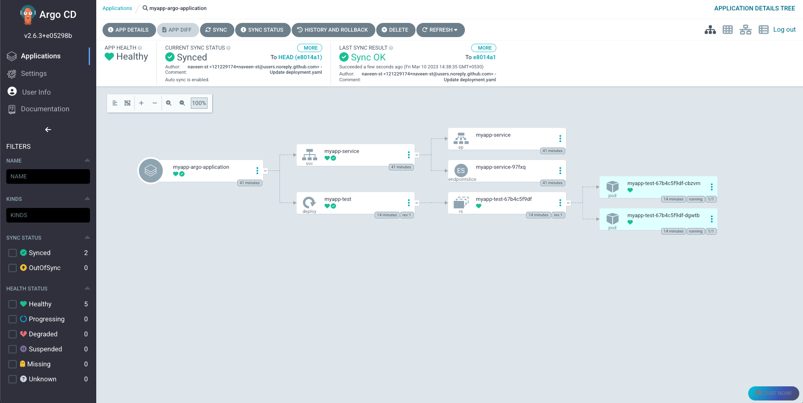


