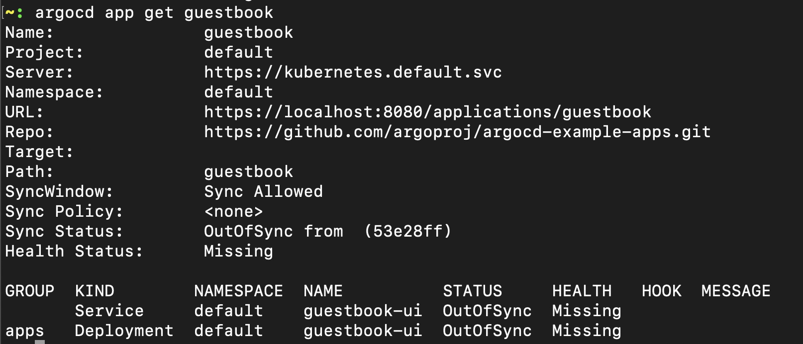
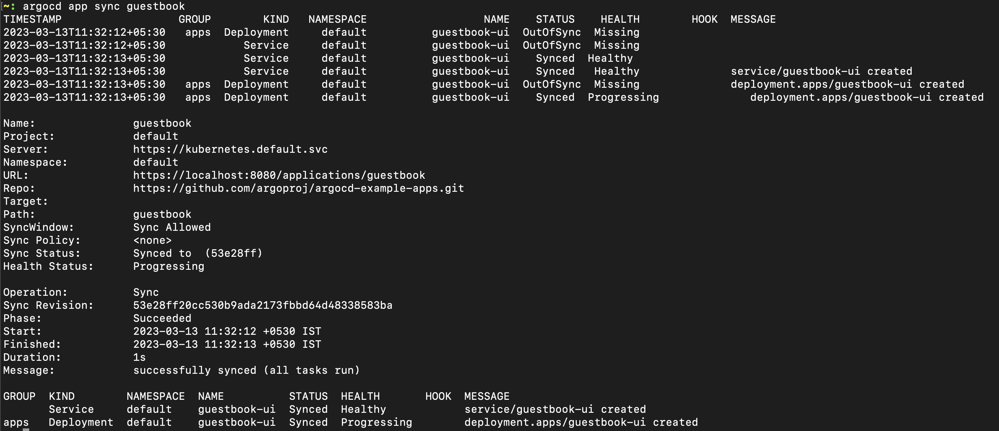
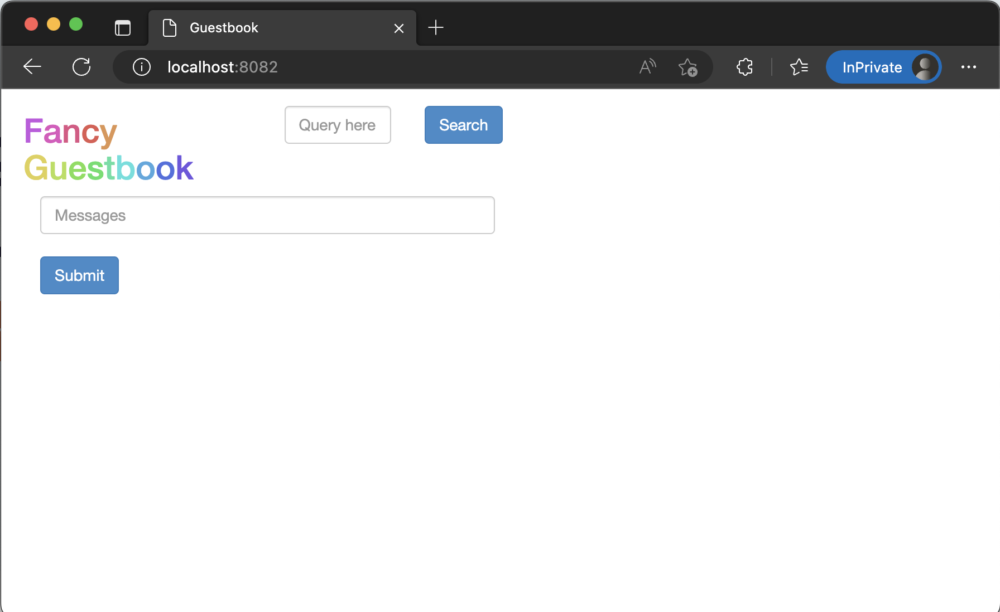

Install cli :
Visit [official doc](https://argo-cd.readthedocs.io/en/stable/getting_started/#2-download-argo-cd-cli) or following steps
- Via homebrew
    ```
    brew install argocd
    ```
- Linux
    ```
    # curl -sSL -o /usr/local/bin/argocd https://github.com/argoproj/argo-cd/releases/latest/download/argocd-linux-amd64
    # chmod +x /usr/local/bin/argocd
    ```
--- 
Login ArgoCD CLI (Local)

1. Retrieve password 
    ```
    kubectl -n argocd get secret argocd-initial-admin-secret -o jsonpath="{.data.password}" | base64 -d; echo
    ```
1. Port forward for ArgoCD server (in separate terminal window)
    ```
    kubectl port-forward -n argocd svc/argocd-server 8080:443
    ```
1. Login (_use password from step 1_)
    ```
    argocd login localhost:8080 --username admin --password tIawB5CPMbffZMQl
    ```
1. Verify argo server is reachable from cli
    ```
    argocd version

    argocd: v2.4.11+3d9e9f2.dirty
    BuildDate: 2022-08-22T19:33:23Z
    GitCommit: 3d9e9f2f95b7801b90377ecfc4073e5f0f07205b
    GitTreeState: dirty
    GoVersion: go1.19
    Compiler: gc
    Platform: darwin/amd64
    argocd-server: v2.6.3+e05298b <========
    BuildDate: 2023-02-27T14:40:19Z
    GitCommit: e05298b9c6ab8610104271fa8491f019fee3c587
    GitTreeState: clean
    GoVersion: go1.18.10
    Compiler: gc
    Platform: linux/amd64
    Kustomize Version: v4.5.7 2022-08-02T16:35:54Z
    Helm Version: v3.10.3+g835b733
    Kubectl Version: v0.24.2
    Jsonnet Version: v0.19.1
    ```
---


- List app
```
    argocd app list  

    NAME                    CLUSTER                         NAMESPACE  PROJECT  STATUS  HEALTH   SYNCPOLICY  CONDITIONS  REPO                                                PATH  TARGET
    myapp-argo-application  https://kubernetes.default.svc  myapp      default  Synced  Healthy  Auto-Prune  <none>      https://github.com/naveen-st/argocd-app-config.git  dev   HEAD
```

---

Create application using cli

- Create app (taking git repo for reference)
   ```
    argocd app create guestbook --repo https://github.com/argoproj/argocd-example-apps.git --path guestbook --dest-namespace default --dest-server https://kubernetes.default.svc --directory-recurse
    ```

- Check app creation
    ```
    argocd app get guestbook       
    ```
    

- Pod is not created 
    ```
    kubectl get pod   
    
    No resources found in default namespace.
    ```

- Sync app
    ```
    argocd app sync guestbook
    ```
    

- Pod is created 
    ```
    kubectl get pod
    
    NAME                           READY   STATUS    RESTARTS   AGE
    guestbook-ui-b848d5d9d-lxrbj   1/1     Running   0          53s

    ```
- Access app, port forward to guestbook-ui service (in separate terminal)
    ```
    kubectl port-forward -n default svc/guestbook-ui 8082:80
    ```
    
---
Delete application

- 
    ```
    argocd app delete guestbook 

    Are you sure you want to delete 'guestbook' and all its resources? [y/n]
    y
    application 'guestbook' deleted
    ```